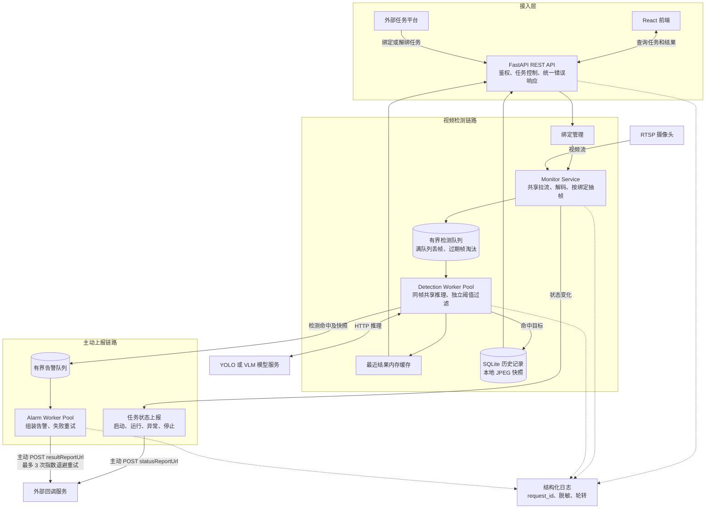
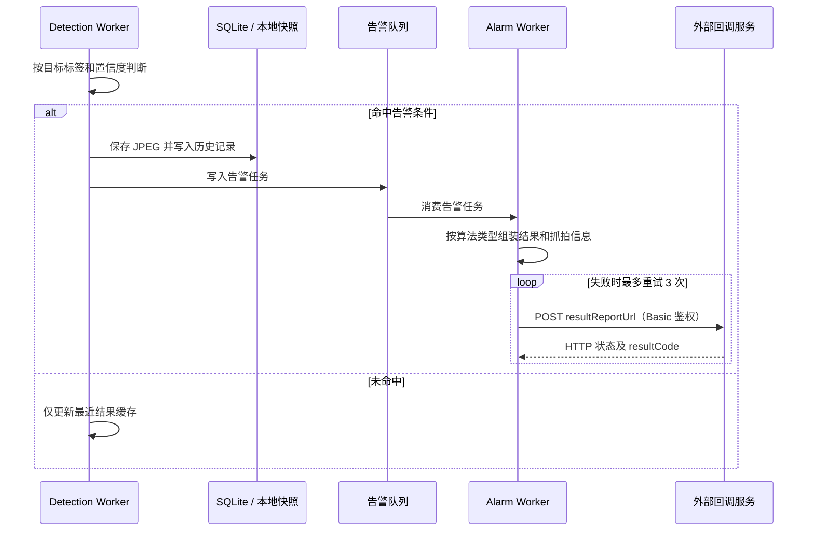

# LightMonitor

LightMonitor 是一个轻量级、配置驱动的**视频流 AI 分析平台**。系统支持动态绑定 RTSP 视频流，通过有界异步队列分发帧任务并调用 AI 模型检测。命中目标后，系统会保存本地快照、将历史记录写入 SQLite，并通过独立的告警队列向外部系统发送 Webhook。

## 核心架构

系统采用 Python 3.12 + FastAPI 构建单体应用，内部划分为任务控制、视频采集、检测和告警四个模块。



处理流程：

1. 前端或外部系统通过 REST API 查询、绑定或解绑检测任务。
2. 相同 `cameraId` 和 `liveUrl` 的多个绑定共享一路 RTSP 连接，避免重复拉流和解码。
3. Monitor 按各绑定的采样频率生成帧任务并写入有界检测队列。队列拥塞时丢弃积压帧，优先保证实时性。
4. Detection Worker 调用模型。同一个 `frame_id` 只执行一次当前模型推理，再按各绑定的目标标签和置信度阈值分别生成结果。
5. 命中目标的结果写入 SQLite、保存 JPEG 快照，并进入独立的有界告警队列，由 Alarm Worker 异步发送 Webhook。

### 主动告警上报



主动上报包含两类消息：

- **任务状态**：Monitor 在启动、运行、异常和停止时向每个绑定的 `statusReportUrl` 主动发送状态。
- **检测告警**：检测命中后，Alarm Worker 向 `resultReportUrl` 主动发送 `bindId`、`cameraId`、算法类型、检测框、置信度、抓拍时间、图片地址和 Base64 抓拍图；HTTP 或业务返回失败时最多重试 3 次，并采用指数退避。

日志与错误处理贯穿全部模块：API 请求通过 `request_id` 关联访问日志、错误响应和后台日志；日志支持 JSON/文本格式、敏感信息脱敏及按时间轮转。

| 组件 | 技术栈 / 实现 |
|---|---|
| Backend | Python 3.12、FastAPI、OpenCV、asyncio、httpx、aiosqlite |
| Frontend | React、TypeScript、Vite |
| Pipeline | 有界 `asyncio.Queue`、Detection Worker Pool、Alarm Worker Pool |
| Protocol | REST API、模型 HTTP API、结果与状态 Webhook |
| Storage | SQLite（历史记录）、本地文件系统（JPEG 快照） |
| Observability | 结构化日志、request ID、敏感信息脱敏、按时间轮转 |
| Deploy | Docker / Docker Compose |

## 快速开始

### 前置要求

- Python 3.12+
- Node.js 20+
- Docker & Docker Compose (推荐)

### 配置文件

编辑 `config/config.yaml` 配置 RTSP 流、AI 模型地址、队列、告警 Webhook、存储和日志。

\`\`\`yaml
streams:
  - bindId: "task-001"
    cameraId: "Camera 1"
    live_url: "rtsp://..."
    enabled: true
    frame_extraction:
      fps: 1

detection:
  model_url: "http://process-detection-service/..."

queue:
  maxsize: 16
  workers: 4
  max_frame_age_s: 5
  alarm_maxsize: 100
  alarm_workers: 2

storage:
  db_path: "data/lightmonitor.db"
  snapshots_dir: "data/snapshots"

logging:
  level: "INFO"
  format: "json"
  file_path: "logs/app.log"
\`\`\`

### 使用 Docker Compose 启动

\`\`\`bash
docker compose up --build -d
\`\`\`

- **Frontend**: http://localhost:3000
- **Backend API**: http://localhost:8000

### 本地开发

**Backend:**

\`\`\`bash
cd backend
python3 -m venv .venv
source .venv/bin/activate
pip install -r requirements.txt
# 启动服务
uvicorn app.main:app --reload --host 0.0.0.0 --port 8000
\`\`\`

**Frontend:**

\`\`\`bash
cd frontend
npm install
npm run dev
\`\`\`

## API 接口说明

### 0. 健康检查

| 方法 | 路径 | 描述 |
|--------|------|-------------|
| `GET`  | `/health` | 服务存活检查, 返回 `{"status": "ok"}` |

---

### 1. 任务管理 (Frontend API)

> 面向前端面板的 REST 接口。`task_id` 即为算法绑定时的 `bindId`。
> 路径前缀: `/api/v1`

| 方法 | 路径 | 描述 |
|--------|------|-------------|
| `GET`  | `/tasks` | 获取所有视频流任务列表及状态 |
| `GET`  | `/tasks/{task_id}` | 获取单个任务详情及最近检测结果 |
| `GET`  | `/tasks/{task_id}/results` | 获取指定任务的历史检测结果 (含 `limit` 查询参数, 默认 20, 范围 1-100) |
| `GET`  | `/history` | 从 SQLite 查询历史记录 (支持按 `stream_id` / `start_ms` / `end_ms` / `limit` 过滤) |
| `GET`  | `/snapshots/{stream_id}/{filename}` | 获取本地存储的抓拍图片 (JPEG) |

#### 1.1 `GET /api/v1/tasks`

**响应** (`List[TaskStatus]`):

| 字段 | 类型 | 说明 |
|------|------|------|
| `stream_id` | string | 即 `bindId`, 任务唯一标识 |
| `stream_name` | string | 即 `cameraId`, 摄像头展示名 |
| `status` | string | 任务状态: `running` / `error` / `offline` / `starting` / `stop` |
| `labels` | string[] | 该任务订阅的算法标签列表 |
| `latest_frame_ts` | int \| null | 最近一帧的时间戳 (毫秒) |

#### 1.2 `GET /api/v1/tasks/{task_id}`

**响应** (`TaskDetail`):

| 字段 | 类型 | 说明 |
|------|------|------|
| `task` | TaskStatus | 同上 |
| `recent_results` | FrameResult[] | 最近若干帧的检测结果 |

**错误码**: `404 Task not found` | `503 Service not ready`

#### 1.3 `GET /api/v1/tasks/{task_id}/results`

**Query 参数**: `limit` (int, 1-100, 默认 20)

**响应**: `FrameResult[]`, 字段说明:

| 字段 | 类型 | 说明 |
|------|------|------|
| `stream_id` | string | `bindId` |
| `stream_name` | string | `cameraId` |
| `timestamp_ms` | int | 帧时间戳 (毫秒) |
| `detections` | DetectionResult[] | 检测结果列表 |
| `alarmed` | bool | 是否触发了告警上报 |
| `image_base64` | string \| null | 抓拍图 Base64 编码 (可选) |

#### 1.4 `GET /api/v1/history`

**Query 参数**:

| 参数 | 类型 | 必填 | 说明 |
|------|------|------|------|
| `stream_id` | string | 否 | 按 `bindId` 过滤 |
| `start_ms` | int | 否 | 起始时间戳 (毫秒, 含) |
| `end_ms` | int | 否 | 截止时间戳 (毫秒, 含) |
| `limit` | int | 否 | 最大返回条数 (1-1000, 默认 100) |

**响应**: `HistoryRecord[]` 数组, 字段: `task_id`, `timestamp_ms`, `stream_id`, `stream_name`, `detections`, `image_url`。

#### 1.5 `GET /api/v1/snapshots/{stream_id}/{filename}`

返回 `image/jpeg` 文件。防止路径穿越 (`..` / `/` 会被拒绝, 返回 `400`)。

---

### 2. 算法绑定 (Open API)

> 面向外部算法平台的动态任务下发/解绑接口。**带 MD5 鉴权中间件**。
> 路径前缀: `/ai-video-analysis/ai/v1/api/algorithm`

| 方法 | 路径 | 描述 |
|--------|------|-------------|
| `POST` | `/bind` | **动态绑定**: 下发新的分析任务 |
| `POST` | `/unbind` | **动态解绑**: 停止并移除分析任务 |

#### 2.1 鉴权说明 (X-Sign MD5)

**所有 `/ai-video-analysis/...` 路径下的请求均需在 Header 中携带 `X-Sign`**:

```
X-Sign: <md5(username + password + base_url)>
```

其中:
- `username` / `password`: 来自 `config.yaml` 的 `api_auth` 段 (默认 `maasadmin` / `Maas@dj0086`)
- `base_url`: 由服务端动态拼接, 格式为 `{scheme}://{host}/ai-video-analysis`
  例: `http://10.253.88.138:8080/ai-video-analysis`

**错误码**:
- `401 Missing signature header (X-Sign)` — 未携带签名
- `403 Signature invalid` — 签名不匹配

#### 2.2 `POST /ai-video-analysis/ai/v1/api/algorithm/bind`

下发一个新的算法分析任务。**异步执行** (通过 `BackgroundTasks` 后台初始化流任务), 接口立即返回。

**请求体** (`BindRequest`):

| 字段 | 类型 | 必填 | 说明 |
|------|------|------|------|
| `sourceSystem` | string | ✅ | 来源系统编码, 如 `SPY` / `HYSP` |
| `bindId` | string (≤48) | ✅ | 任务唯一标识, 整个系统的主键 |
| `cameraId` | string (≤48) | ✅ | 摄像头 ID (仅作展示, 不参与区分任务) |
| `algorithmList` | string[] | ✅ | 订阅的算法编码列表 (即 `labels`) |
| `configuation` | TaskConfig | 否 | 阈值/抑制时间/状态上报周期等 |
| `liveUrl` | string (≤256) | ✅ | 查询实时视频流的 API 地址 |
| `report` | ReportConfig | ✅ | 状态/结果上报地址 (见下) |
| `beginTime` | string | 否 | 任务生效起始时间 |
| `endTime` | string | 否 | 任务生效截止时间 |
| `extendParamJson` | string \| object | 否 | 扩展参数 |

`report` (ReportConfig) 字段:

| 字段 | 类型 | 必填 | 说明 |
|------|------|------|------|
| `status_report_url` | string | 否 | 任务状态变更上报地址 |
| `result_report_url` | string | 否 | 检测结果上报地址 |

`configuation` (TaskConfig) 字段:

| 字段 | 类型 | 说明 |
|------|------|------|
| `threshold` | int | 检测阈值 |
| `holddownTime` | int | 告警抑制时间 (秒) |
| `stateReportTime` | int | 状态上报周期 (秒) |

**服务侧处理逻辑** (重要):

1. **地址处理**: `rtsp://` / `rtsps://` 地址直接连接；HTTP(S) 地址作为视频地址查询接口调用，不再重写请求中的 IP。
2. **注册语义**: 接口在绑定注册完成后返回；RTSP 连接、帧抓取和推理继续在受管理的后台任务中运行。
3. **重复 `bindId`**: 使用相同 `cameraId` 时更新标签、采样周期和上报配置；共享视频源运行期间不允许通过更新绑定切换地址。
4. **一流多任务**: 相同 `cameraId` 与 `liveUrl` 的多个 `bindId` 共享一个物理 RTSP 连接。同一帧、同一全局模型只推理一次，再按各绑定标签分别判断和上报。
5. **回调处理**: 状态按绑定独立上报；告警进入有界队列，由固定 worker 重试发送，避免无限创建后台任务。

**响应** (`BindResponse`):

```json
{ "resultCode": 0, "resultDesc": "SUCCESS" }
```

**错误码**: `503 Monitor service not initialized`

#### 2.3 `POST /ai-video-analysis/ai/v1/api/algorithm/unbind`

停止并移除指定的分析任务。

**请求体** (`UnbindRequest`):

| 字段 | 类型 | 必填 | 说明 |
|------|------|------|------|
| `sourceSystem` | string | ✅ | 来源系统编码 |
| `bindId` | string | ✅ | 要解绑的任务 ID (匹配主键) |
| `cameraId` | string | ✅ | 摄像头 ID (仅记录, 不参与匹配) |
| `algorithmList` | string[] | ✅ | 关联算法列表 (仅记录) |

**响应** (`UnbindResponse`):

成功:
```json
{ "resultCode": 0, "resultDesc": "解绑1条数据" }
```

未找到:
```json
{ "resultCode": 1, "resultDesc": "bindId xxx 不存在" }
```

**错误码**: `503 Monitor service not initialized`

#### 2.4 通用错误响应

前端 REST API 使用统一错误结构，并通过响应头返回相同的 `X-Request-ID`：

```json
{
  "error": {
    "code": "TASK_NOT_FOUND",
    "message": "任务不存在",
    "request_id": "4f13...",
    "details": null
  }
}
```

服务端日志保留内部异常堆栈，对外响应不会暴露堆栈、鉴权信息或内部响应正文。

---

### 3. Webhook 上报协议 (Outbound)

> 系统主动调用外部接口, 推送**任务状态**和**检测结果**。上报地址取自 `/bind` 请求中的 `report` 字段。

#### 3.1 状态上报 (Status Report)

**触发时机**: 任务启动 (`STARTING` → `RUNNING`)、停止、错误时各调用一次。

**请求方式**: `POST` (JSON), 上报到 `report.status_report_url`。

**请求体**:

| 字段 | 类型 | 说明 |
|------|------|------|
| `algorithmType` | string | `algorithmList[0]` (首个订阅算法) |
| `bindId` | string | 任务 ID |
| `cameraId` | string | 摄像头 ID |
| `status` | int | `0=INIT` / `1=STARTING` / `2=RUNNING` / `3=STOP` / `4=ERROR` |

#### 3.2 结果上报 (Result Report)

**触发时机**: 任意帧产生检测结果时 (每帧最多 1 次, 重试 3 次, 指数退避)。

**请求方式**: `POST` (JSON), 上报到 `report.result_report_url`。

**请求体**:

| 字段 | 类型 | 必填 | 说明 |
|------|------|------|------|
| `captureTime` | string | ✅ | 抓拍时间, 格式 `yyyy-MM-dd HH:mm:ss` |
| `captureBase64` | string | 否 | 全景图 Base64 |
| `detectBase64` | string | 否 | 识别小图 Base64 |
| `desc` | string | 否 | 告警描述 |
| `attributes` | object | 否 | 结构化属性 (允许任意 KV 扩展) |

`attributes` 内部按算法类型分组, 每组结构示例:

```json
{
  "results": [
    { "confidence": 0.91, "x": 100, "y": 200, "width": 50, "height": 80 }
  ],
  "snap": {
    "data": {
      "attributes": {
        "result": {
          "positions": [
            [x_min, y_min, x_max, y_max, "0.9100", "label_name"]
          ]
        }
      }
    }
  }
}
```

## 日志与队列配置

```yaml
queue:
  maxsize: 16
  workers: 4
  max_frame_age_s: 5
  shutdown_timeout_s: 10
  alarm_maxsize: 100
  alarm_workers: 2

logging:
  level: INFO
  format: json          # json | text
  console_enabled: true
  file_enabled: true
  file_path: logs/app.log
  rotate_when: midnight
  backup_count: 7
```

生产日志默认使用 JSON，并包含 `event`、`request_id`、`bind_id`、耗时及重试次数等字段。Authorization、Token、密码和 Base64 图片不会写入日志。

## 项目结构

\`\`\`
├── config/
│   └── config.yaml         # 全局配置文件
├── backend/
│   ├── app/
│   │   ├── main.py             # FastAPI 入口
│   │   ├── config.py           # 配置加载与 Pydantic 模型
│   │   ├── models.py           # 数据模型定义
│   │   ├── api/
│   │   │   ├── v1/
│   │   │   │   ├── tasks.py        # 前端交互 API
│   │   │   │   ├── algo_bind.py    # 算法绑定/解绑 API
│   │   │   │   └── algo_auth.py    # API 鉴权中间件
│   │   ├── services/
│   │   │   ├── monitor.py      # RTSP流读取与任务管理
│   │   │   ├── detection.py    # AI 推理与结果处理 (Queue Consumer)
│   │   │   └── alarm.py        # 告警与回调服务
│   ├── tests/                  # Pytest 测试用例
│   ├── requirements.txt
│   └── Dockerfile
├── frontend/
│   ├── src/
│   │   ├── App.tsx
│   │   ├── api/client.ts       # Axios 封装
│   │   ├── pages/              # 页面组件
│   │   └── components/         # UI 组件
│   ├── package.json
│   └── vite.config.ts
└── docker-compose.yml
\`\`\`

## License
